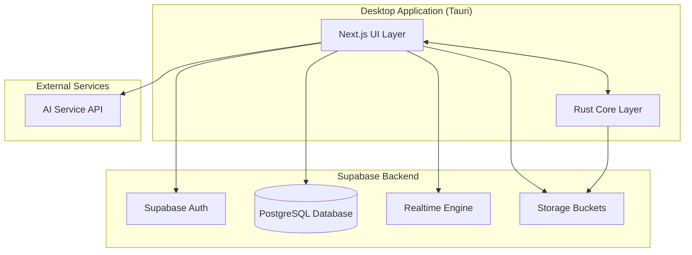

# Design Document: MSN Messenger Clone

## Overview

The MSN Messenger Clone is a cross-platform desktop application built with Tauri (Rust backend), Next.js (React frontend), TailwindCSS (styling), and Supabase (backend services). The application replicates the classic MSN Messenger 7.5 experience while leveraging modern technologies for real-time communication, authentication, and data persistence.

### Technology Stack

- **Frontend**: Next.js 14+ (React 18+), TailwindCSS 3+
- **Desktop Framework**: Tauri 2.x (Rust)
- **Backend Services**: Supabase (PostgreSQL, Realtime, Auth, Storage)
- **AI Integration**: OpenAI API or similar for chatbot functionality
- **State Management**: Zustand or React Context
- **Real-time Communication**: Supabase Realtime (WebSocket-based)

## Architecture

### High-Level Architecture



### Application Layers

1. **Presentation Layer (Next.js + TailwindCSS)**
   - React components replicating MSN Messenger UI
   - State management for UI interactions
   - Real-time updates via Supabase subscriptions

2. **Application Layer (Tauri Rust)**
   - Native system integrations (notifications, file system, system tray)
   - File transfer handling
   - Local storage and caching
   - Window management

3. **Backend Layer (Supabase)**
   - User authentication and authorization
   - Real-time message delivery
   - Data persistence
   - File storage

4. **AI Layer (External API)**
   - Chatbot conversation handling
   - Response generation

## Components and Interfaces

### Frontend Components

#### 1. Authentication Components

**SignInWindow**
- Email/password input fields
- "Remember me" checkbox
- Sign-in button
- Link to registration

**RegistrationWindow**
- Username, email, password fields
- Password confirmation
- Terms acceptance checkbox
- Register button

#### 2. Main Application Components

**MainWindow**
- Top bar with user profile (display picture, name, status)
- Contact list panel
- Menu bar (File, Contacts, Actions, Tools, Help)
- Status selector dropdown
- Search bar

**ContactList**
- Grouped contacts (Online, Offline, Blocked)
- Contact items showing:
  - Display picture
  - Display name
  - Personal message
  - Presence status icon
- Right-click context menu
- Drag-and-drop for grouping

**ContactItem**
- Display picture (96x96px, circular)
- Name and status text
- Presence indicator (colored dot)
- Hover effects

#### 3. Chat Components

**ChatWindow**
- Window title with contact name
- Message history panel (scrollable)
- Message composition area
- Toolbar (emoticons, formatting, file transfer)
- Participant list (for group chats)
- Typing indicator

**MessageBubble**
- Sender identification
- Timestamp
- Message content (text, emoticons, formatted text)
- Delivery status indicator

**EmoticonPicker**
- Grid of emoticon images
- Search/filter functionality
- Recently used section

#### 4. AI Chatbot Components

**ChatbotList**
- Available chatbot cards
- Chatbot personality descriptions
- "Start Chat" buttons

**ChatbotWindow**
- Identical to ChatWindow but with AI branding
- Response loading indicator

#### 5. Settings Components

**SettingsWindow**
- Tabbed interface:
  - General (startup, notifications)
  - Privacy (status visibility, blocking)
  - Sounds (notification sounds, volume)
  - Files (download location)
  - Profile (display picture, personal info)

### Backend Schema (Supabase PostgreSQL)

#### Users Table
```sql
CREATE TABLE users (
  id UUID PRIMARY KEY DEFAULT uuid_generate_v4(),
  email TEXT UNIQUE NOT NULL,
  username TEXT UNIQUE NOT NULL,
  display_name TEXT,
  personal_message TEXT,
  display_picture_url TEXT,
  presence_status TEXT DEFAULT 'offline',
  last_seen TIMESTAMP,
  created_at TIMESTAMP DEFAULT NOW(),
  updated_at TIMESTAMP DEFAULT NOW()
);
```

#### Contacts Table
```sql
CREATE TABLE contacts (
  id UUID PRIMARY KEY DEFAULT uuid_generate_v4(),
  user_id UUID REFERENCES users(id) ON DELETE CASCADE,
  contact_user_id UUID REFERENCES users(id) ON DELETE CASCADE,
  status TEXT DEFAULT 'pending', -- pending, accepted, blocked
  created_at TIMESTAMP DEFAULT NOW(),
  UNIQUE(user_id, contact_user_id)
);
```

#### Messages Table
```sql
CREATE TABLE messages (
  id UUID PRIMARY KEY DEFAULT uuid_generate_v4(),
  conversation_id UUID NOT NULL,
  sender_id UUID REFERENCES users(id) ON DELETE CASCADE,
  content TEXT NOT NULL,
  message_type TEXT DEFAULT 'text', -- text, file, system
  metadata JSONB, -- for emoticons, formatting, file info
  created_at TIMESTAMP DEFAULT NOW(),
  delivered_at TIMESTAMP,
  read_at TIMESTAMP
);

CREATE INDEX idx_messages_conversation ON messages(conversation_id, created_at DESC);
```

#### Conversations Table
```sql
CREATE TABLE conversations (
  id UUID PRIMARY KEY DEFAULT uuid_generate_v4(),
  type TEXT NOT NULL, -- one_on_one, group
  name TEXT, -- for group chats
  created_by UUID REFERENCES users(id),
  created_at TIMESTAMP DEFAULT NOW(),
  updated_at TIMESTAMP DEFAULT NOW()
);
```

#### Conversation Participants Table
```sql
CREATE TABLE conversation_participants (
  id UUID PRIMARY KEY DEFAULT uuid_generate_v4(),
  conversation_id UUID REFERENCES conversations(id) ON DELETE CASCADE,
  user_id UUID REFERENCES users(id) ON DELETE CASCADE,
  joined_at TIMESTAMP DEFAULT NOW(),
  left_at TIMESTAMP,
  UNIQUE(conversation_id, user_id)
);
```

#### AI Chatbot Conversations Table
```sql
CREATE TABLE ai_conversations (
  id UUID PRIMARY KEY DEFAULT uuid_generate_v4(),
  user_id UUID REFERENCES users(id) ON DELETE CASCADE,
  chatbot_type TEXT NOT NULL, -- personality identifier
  created_at TIMESTAMP DEFAULT NOW()
);
```

#### Files Table
```sql
CREATE TABLE files (
  id UUID PRIMARY KEY DEFAULT uuid_generate_v4(),
  message_id UUID REFERENCES messages(id) ON DELETE CASCADE,
  filename TEXT NOT NULL,
  file_size BIGINT NOT NULL,
  mime_type TEXT NOT NULL,
  storage_path TEXT NOT NULL,
  upload_status TEXT DEFAULT 'pending', -- pending, completed, failed
  created_at TIMESTAMP DEFAULT NOW()
);
```

### Tauri Commands (Rust Backend)

```rust
// System integration commands
#[tauri::command]
async fn show_notification(title: String, body: String) -> Result<(), String>

#[tauri::command]
async fn play_sound(sound_type: String) -> Result<(), String>

#[tauri::command]
async fn save_file(file_data: Vec<u8>, filename: String) -> Result<String, String>

#[tauri::command]
async fn open_file_dialog() -> Result<String, String>

#[tauri::command]
async fn set_system_tray_status(status: String) -> Result<(), String>

#[tauri::command]
async fn get_app_data_dir() -> Result<String, String>

#[tauri::command]
async fn set_auto_launch(enabled: bool) -> Result<(), String>
```

### Supabase Client API

#### Authentication
```typescript
// Sign up
const { data, error } = await supabase.auth.signUp({
  email: string,
  password: string,
  options: {
    data: { username: string, display_name: string }
  }
})

// Sign in
const { data, error } = await supabase.auth.signInWithPassword({
  email: string,
  password: string
})

// Sign out
const { error } = await supabase.auth.signOut()
```

#### Real-time Subscriptions
```typescript
// Subscribe to presence changes
const presenceChannel = supabase
  .channel('presence')
  .on('postgres_changes', 
    { event: 'UPDATE', schema: 'public', table: 'users' },
    (payload) => handlePresenceChange(payload)
  )
  .subscribe()

// Subscribe to new messages
const messagesChannel = supabase
  .channel(`conversation:${conversationId}`)
  .on('postgres_changes',
    { event: 'INSERT', schema: 'public', table: 'messages', 
      filter: `conversation_id=eq.${conversationId}` },
    (payload) => handleNewMessage(payload)
  )
  .subscribe()
```

#### Database Operations
```typescript
// Add contact
const { data, error } = await supabase
  .from('contacts')
  .insert({ user_id, contact_user_id, status: 'pending' })

// Send message
const { data, error } = await supabase
  .from('messages')
  .insert({
    conversation_id,
    sender_id,
    content,
    message_type: 'text',
    metadata: { emoticons: [], formatting: {} }
  })

// Update presence
const { data, error } = await supabase
  .from('users')
  .update({ presence_status, updated_at: new Date() })
  .eq('id', userId)
```

#### Storage Operations
```typescript
// Upload display picture
const { data, error } = await supabase.storage
  .from('display-pictures')
  .upload(`${userId}/avatar.png`, file)

// Upload file for transfer
const { data, error } = await supabase.storage
  .from('file-transfers')
  .upload(`${conversationId}/${filename}`, file)

// Download file
const { data, error } = await supabase.storage
  .from('file-transfers')
  .download(path)
```

## Data Models

### TypeScript Interfaces

```typescript
interface User {
  id: string;
  email: string;
  username: string;
  displayName: string;
  personalMessage: string;
  displayPictureUrl: string;
  presenceStatus: 'online' | 'away' | 'busy' | 'appear_offline' | 'offline';
  lastSeen: Date;
  createdAt: Date;
  updatedAt: Date;
}

interface Contact {
  id: string;
  userId: string;
  contactUser: User;
  status: 'pending' | 'accepted' | 'blocked';
  createdAt: Date;
}

interface Message {
  id: string;
  conversationId: string;
  senderId: string;
  sender?: User;
  content: string;
  messageType: 'text' | 'file' | 'system';
  metadata: {
    emoticons?: Array<{ position: number; code: string }>;
    formatting?: { bold?: boolean; italic?: boolean; color?: string };
    fileInfo?: { filename: string; size: number; mimeType: string };
  };
  createdAt: Date;
  deliveredAt?: Date;
  readAt?: Date;
}

interface Conversation {
  id: string;
  type: 'one_on_one' | 'group';
  name?: string;
  participants: User[];
  lastMessage?: Message;
  createdBy: string;
  createdAt: Date;
  updatedAt: Date;
}

interface ChatbotPersonality {
  id: string;
  name: string;
  description: string;
  avatarUrl: string;
  systemPrompt: string;
}

interface AppSettings {
  notifications: {
    enabled: boolean;
    soundEnabled: boolean;
    soundVolume: number;
    desktopAlerts: boolean;
  };
  startup: {
    autoLaunch: boolean;
    startMinimized: boolean;
  };
  files: {
    downloadLocation: string;
    autoAcceptFrom: string[];
  };
}
```

## Error Handling

### Error Categories

1. **Network Errors**
   - Connection timeout
   - WebSocket disconnection
   - API request failures

2. **Authentication Errors**
   - Invalid credentials
   - Session expiration
   - Token refresh failures

3. **Validation Errors**
   - Invalid input data
   - File size/type restrictions
   - Message length limits

4. **System Errors**
   - File system access denied
   - Notification permission denied
   - Audio playback failures

### Error Handling Strategy

```typescript
// Centralized error handler
class ErrorHandler {
  static handle(error: AppError) {
    switch (error.category) {
      case 'network':
        return this.handleNetworkError(error);
      case 'auth':
        return this.handleAuthError(error);
      case 'validation':
        return this.handleValidationError(error);
      case 'system':
        return this.handleSystemError(error);
    }
  }

  static handleNetworkError(error: NetworkError) {
    // Show reconnection UI
    // Attempt automatic reconnection
    // Queue messages for retry
  }

  static handleAuthError(error: AuthError) {
    // Clear session
    // Redirect to sign-in
    // Show appropriate message
  }
}
```

### Retry Logic

```typescript
// Exponential backoff for WebSocket reconnection
const reconnectWithBackoff = async (attempt: number = 0) => {
  const maxAttempts = 10;
  const baseDelay = 1000;
  
  if (attempt >= maxAttempts) {
    showError('Unable to connect. Please check your internet connection.');
    return;
  }
  
  const delay = Math.min(baseDelay * Math.pow(2, attempt), 30000);
  await sleep(delay);
  
  try {
    await establishConnection();
  } catch (error) {
    reconnectWithBackoff(attempt + 1);
  }
};
```

## Testing Strategy

### Unit Testing

**Frontend Components**
- Test component rendering with various props
- Test user interactions (clicks, inputs)
- Test state management logic
- Mock Supabase client calls

**Rust Commands**
- Test file system operations
- Test notification triggers
- Test system tray interactions
- Mock system APIs

### Integration Testing

**Authentication Flow**
- Test complete sign-up process
- Test sign-in with valid/invalid credentials
- Test session persistence
- Test sign-out

**Messaging Flow**
- Test sending messages between users
- Test real-time message delivery
- Test message persistence
- Test typing indicators

**Contact Management**
- Test adding contacts
- Test accepting/declining requests
- Test removing contacts
- Test blocking users

### End-to-End Testing

**Critical User Journeys**
1. New user registration → Add contacts → Send first message
2. Sign in → Receive message → Reply → Send file
3. Change presence status → Start group chat → Leave conversation
4. Chat with AI chatbot → Search chat history

**Tools**
- Playwright or Cypress for E2E tests
- Mock Supabase backend for consistent test environment

### Performance Testing

**Metrics to Monitor**
- Message delivery latency (target: <1 second)
- UI responsiveness (target: 60 FPS)
- Memory usage (target: <200 MB idle)
- Application startup time (target: <3 seconds)

**Load Testing**
- Test with 100+ contacts
- Test with 1000+ messages in history
- Test concurrent file transfers
- Test WebSocket connection stability

## UI/UX Design Specifications

### Classic MSN Messenger Visual Elements

**Color Palette**
- Primary Blue: #0066CC
- Light Blue: #E6F2FF
- Window Background: #ECE9D8 (Windows XP theme)
- Text Primary: #000000
- Text Secondary: #666666
- Online Green: #00CC00
- Away Orange: #FF9900
- Busy Red: #CC0000

**Typography**
- Primary Font: Tahoma, Arial, sans-serif
- Font Sizes:
  - Display Name: 11px bold
  - Personal Message: 9px regular
  - Chat Messages: 10px regular
  - Menu Items: 11px regular

**Window Dimensions**
- Main Window: 250px width × 600px height (resizable)
- Chat Window: 500px width × 400px height (resizable)
- Minimum Window Size: 200px × 300px

**Spacing and Layout**
- Contact Item Height: 52px
- Contact Item Padding: 8px
- Message Bubble Padding: 8px 12px
- Window Padding: 8px

### Emoticon System

**Classic MSN Emoticons**
- Implement 30+ classic emoticons (smile, wink, tongue, etc.)
- Emoticon size: 19×19 pixels
- Shortcut mapping (e.g., `:)` → smile, `;)` → wink)
- Animated GIF support for special emoticons

### Animations and Transitions

- Contact status change: Fade transition (200ms)
- Window open/close: Slide animation (150ms)
- Message send: Fade-in (100ms)
- Typing indicator: Pulsing animation (1s loop)

## Security Considerations

### Authentication Security
- Passwords hashed with bcrypt (handled by Supabase Auth)
- JWT tokens for session management
- Automatic token refresh
- Secure token storage in Tauri's secure storage

### Data Privacy
- End-to-end encryption for file transfers (optional enhancement)
- Secure WebSocket connections (WSS)
- User data isolation via Row Level Security (RLS) in Supabase

### Supabase RLS Policies

```sql
-- Users can only read their own data
CREATE POLICY "Users can view own profile"
  ON users FOR SELECT
  USING (auth.uid() = id);

-- Users can only update their own data
CREATE POLICY "Users can update own profile"
  ON users FOR UPDATE
  USING (auth.uid() = id);

-- Users can only see accepted contacts
CREATE POLICY "Users can view own contacts"
  ON contacts FOR SELECT
  USING (auth.uid() = user_id OR auth.uid() = contact_user_id);

-- Users can only see messages in their conversations
CREATE POLICY "Users can view own messages"
  ON messages FOR SELECT
  USING (
    EXISTS (
      SELECT 1 FROM conversation_participants
      WHERE conversation_id = messages.conversation_id
      AND user_id = auth.uid()
    )
  );
```

## Deployment and Distribution

### Build Process

```bash
# Development
npm run tauri dev

# Production build
npm run tauri build
```

### Platform-Specific Builds

**Windows**
- Output: `.exe` installer and `.msi` package
- Code signing certificate required for production
- Windows Defender SmartScreen consideration

**macOS**
- Output: `.dmg` disk image and `.app` bundle
- Apple Developer ID signing required
- Notarization for Gatekeeper

**Linux**
- Output: `.AppImage`, `.deb`, and `.rpm` packages
- Desktop entry file for application menu integration

### Auto-Update Strategy

- Implement Tauri's built-in updater
- Check for updates on application startup
- Download and install updates in background
- Prompt user to restart after update download

## Performance Optimizations

### Frontend Optimizations
- Virtual scrolling for large contact lists and message history
- Lazy loading of display pictures
- Debounced search input
- Memoized React components
- Code splitting for faster initial load

### Backend Optimizations
- Database indexes on frequently queried columns
- Message pagination (50 messages per page)
- Cached user presence status (5-second TTL)
- Compressed file transfers
- WebSocket connection pooling

### Caching Strategy
- Local cache for user profiles (1 hour TTL)
- Local cache for display pictures (24 hour TTL)
- IndexedDB for offline message queue
- Service worker for asset caching

## AI Chatbot Implementation

### Chatbot Personalities

1. **Friendly Assistant**
   - Helpful and supportive
   - Answers questions and provides advice
   - System prompt: "You are a friendly and helpful assistant..."

2. **Casual Friend**
   - Conversational and relaxed
   - Discusses hobbies, entertainment, daily life
   - System prompt: "You are a casual friend who enjoys chatting..."

3. **Creative Companion**
   - Imaginative and artistic
   - Helps with creative projects and brainstorming
   - System prompt: "You are a creative companion who loves art..."

### AI Integration

```typescript
// AI service wrapper
class AIService {
  async sendMessage(
    chatbotType: string,
    message: string,
    conversationHistory: Message[]
  ): Promise<string> {
    const systemPrompt = this.getSystemPrompt(chatbotType);
    const messages = this.formatHistory(conversationHistory);
    
    const response = await fetch('https://api.openai.com/v1/chat/completions', {
      method: 'POST',
      headers: {
        'Authorization': `Bearer ${process.env.OPENAI_API_KEY}`,
        'Content-Type': 'application/json'
      },
      body: JSON.stringify({
        model: 'gpt-3.5-turbo',
        messages: [
          { role: 'system', content: systemPrompt },
          ...messages,
          { role: 'user', content: message }
        ],
        max_tokens: 150,
        temperature: 0.8
      })
    });
    
    const data = await response.json();
    return data.choices[0].message.content;
  }
}
```

### Rate Limiting
- Limit AI requests to 10 per minute per user
- Show loading indicator during AI response generation
- Cache common responses for faster replies

## Future Enhancements

### Phase 2 Features
- Voice and video calling (WebRTC)
- Custom emoticon creation
- Themes and skins
- Nudge/buzz feature
- Games and activities

### Phase 3 Features
- Mobile companion app
- Browser-based web client
- Plugin/extension system
- Advanced AI features (voice chat, image generation)
