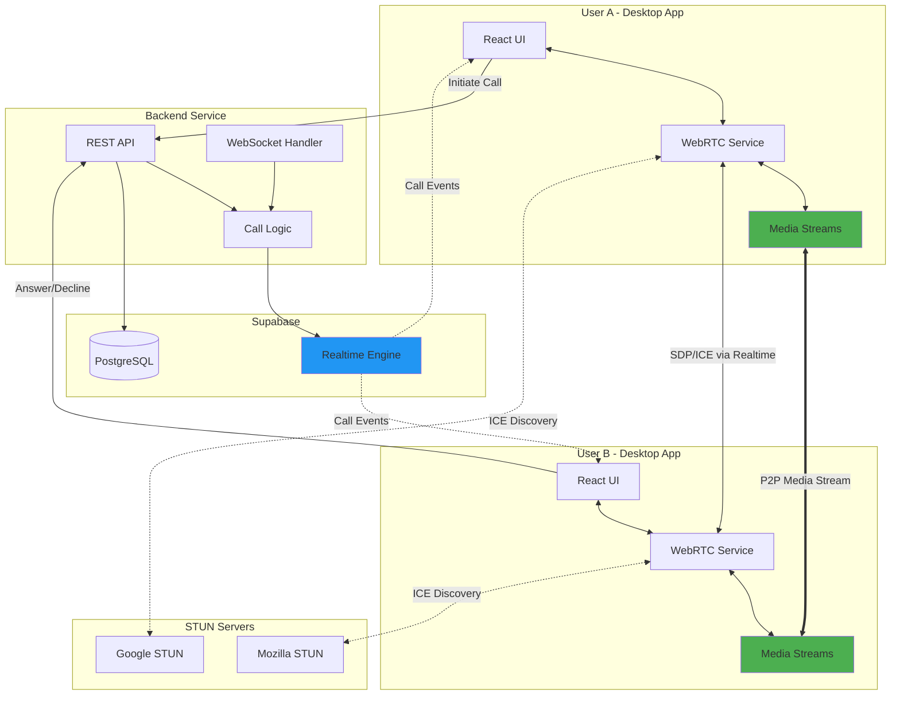

# Design Document: P2P WebRTC Voice/Video Calls

## Overview

This design document outlines the architecture and implementation approach for adding peer-to-peer (P2P) voice and video calling capabilities to the MSN Messenger Clone application. The solution leverages WebRTC for media streaming, the existing Backend Service for signaling, and Supabase Realtime for real-time message delivery.

### Key Design Decisions

1. **One-on-One Calls Only**: Initial implementation supports only 1:1 calls to simplify P2P connection management
2. **STUN-Only Configuration**: Use public STUN servers without TURN relay, achieving ~85% connection success rate
3. **Signaling via Backend Service**: Reuse existing Fastify server with WebSocket support for SDP/ICE exchange
4. **Call as Special Message Type**: Integrate calls into existing conversation system for unified history
5. **Classic MSN Messenger UX**: Ringing notification window and in-call overlay matching original MSN experience

### Technology Stack

- **WebRTC API**: RTCPeerConnection for P2P media streaming
- **Signaling**: Backend Service (Fastify) + Supabase Realtime
- **Media Handling**: getUserMedia API for camera/microphone access
- **State Management**: React Query for API calls, Zustand for WebRTC state
- **Database**: PostgreSQL (Supabase) for call history and state

## Architecture

### High-Level Architecture



### Call Flow Sequence

```mermaid
sequenceDiagram
    participant A as User A (Caller)
    participant A_WS as A WebRTC Service
    participant Backend as Backend Service
    participant Realtime as Supabase Realtime
    participant B_WS as B WebRTC Service
    participant B as User B (Callee)
    participant STUN as STUN Servers
    
    A->>Backend: POST /api/calls/initiate
    Backend->>Realtime: Publish call_ringing event
    Realtime-->>B: call_ringing notification
    B->>B: Show ringing window
    B->>B: Play ringing sound
    
    B->>Backend: POST /api/calls/answer
    Backend->>Realtime: Publish call_answered event
    Realtime-->>A: call_answered notification
    
    A_WS->>A_WS: Create RTCPeerConnection
    A_WS->>STUN: Gather ICE candidates
    A_WS->>A_WS: Create SDP offer
    A_WS->>Backend: POST /api/calls/signal (offer)
    Backend->>Realtime: Publish sdp_offer event
    Realtime-->>B_WS: sdp_offer
    
    B_WS->>B_WS: Create RTCPeerConnection
    B_WS->>B_WS: Set remote description (offer)
    B_WS->>STUN: Gather ICE candidates
    B_WS->>B_WS: Create SDP answer
    B_WS->>Backend: POST /api/calls/signal (answer)
    Backend->>Realtime: Publish sdp_answer event
    Realtime-->>A_WS: sdp_answer
    
    A_WS->>A_WS: Set remote description (answer)
    
    loop ICE Candidate Exchange
        A_WS->>Backend: POST /api/calls/signal (ice_candidate)
        Backend->>Realtime: Publish ice_candidate event
        Realtime-->>B_WS: ice_candidate
        B_WS->>B_WS: Add ICE candidate
    end
    
    A_WS<-->B_WS: P2P Connection Established
    A_WS<-->B_WS: Media Streams Flow
    
    A->>A_WS: Click hang up
    A_WS->>Backend: POST /api/calls/end
    Backend->>Realtime: Publish call_ended event
    Realtime-->>B_WS: call_ended
    B_WS->>B_WS: Close connection
    A_WS->>A_WS: Close connection
```

## Components and Interfaces

### Frontend Components

#### 1. WebRTC Service Layer

**webrtc-service.ts**

Core service managing RTCPeerConnection lifecycle:

```typescript
interface WebRTCService {
  // Connection management
  createPeerConnection(config: RTCConfiguration): RTCPeerConnection;
  closePeerConnection(): void;
  
  // Media management
  getLocalStream(constraints: MediaStreamConstraints): Promise<MediaStream>;
  stopLocalStream(): void;
  setRemoteStream(stream: MediaStream): void;
  
  // Signaling
  createOffer(): Promise<RTCSessionDescriptionInit>;
  createAnswer(offer: RTCSessionDescriptionInit): Promise<RTCSessionDescriptionInit>;
  setRemoteDescription(description: RTCSessionDescriptionInit): Promise<void>;
  addIceCandidate(candidate: RTCIceCandidateInit): Promise<void>;
  
  // Call controls
  toggleMute(): void;
  toggleCamera(): void;
  
  // Event emitters
  onIceCandidate(callback: (candidate: RTCIceCandidate) => void): void;
  onConnectionStateChange(callback: (state: RTCPeerConnectionState) => void): void;
  onRemoteStream(callback: (stream: MediaStream) => void): void;
}
```

**Implementation Details:**

- Singleton pattern for single active call
- Event emitter for state changes
- Automatic cleanup on connection close
- Error handling with retry logic
- ICE candidate buffering before remote description is set

#### 2. React Query Hooks

**call-hooks.ts**

Custom hooks for call-related API operations:

```typescript
// Initiate a call
export function useCallInitiate() {
  const queryClient = useQueryClient();
  
  return useMutation({
    mutationFn: (params: { conversationId: string; callType: 'audio' | 'video' }) =>
      callService.initiateCall(params),
    onSuccess: (call) => {
      queryClient.invalidateQueries({ queryKey: ['calls'] });
    }
  });
}

// Answer a call
export function useCallAnswer() {
  return useMutation({
    mutationFn: (callId: string) => callService.answerCall(callId)
  });
}

// Decline a call
export function useCallDecline() {
  return useMutation({
    mutationFn: (callId: string) => callService.declineCall(callId)
  });
}

// End a call
export function useCallEnd() {
  return useMutation({
    mutationFn: (callId: string) => callService.endCall(callId)
  });
}

// Send signaling data
export function useCallSignal() {
  return useMutation({
    mutationFn: (params: { callId: string; type: string; data: any }) =>
      callService.sendSignal(params)
  });
}

// Get active call
export function useActiveCall(conversationId: string) {
  return useQuery({
    queryKey: ['active-call', conversationId],
    queryFn: () => callService.getActiveCall(conversationId),
    refetchInterval: false
  });
}
```

#### 3. Zustand Store for WebRTC State

**call-store.ts**

Local state management for active call:

```typescript
interface CallState {
  // Call metadata
  activeCall: Call | null;
  callState: 'idle' | 'initiating' | 'ringing' | 'connecting' | 'active' | 'ended';
  
  // Media state
  localStream: MediaStream | null;
  remoteStream: MediaStream | null;
  isMuted: boolean;
  isCameraOff: boolean;
  
  // Connection state
  connectionState: RTCPeerConnectionState;
  iceConnectionState: RTCIceConnectionState;
  
  // Actions
  setActiveCall: (call: Call | null) => void;
  setCallState: (state: CallState['callState']) => void;
  setLocalStream: (stream: MediaStream | null) => void;
  setRemoteStream: (stream: MediaStream | null) => void;
  toggleMute: () => void;
  toggleCamera: () => void;
  setConnectionState: (state: RTCPeerConnectionState) => void;
  reset: () => void;
}
```

#### 4. UI Components

**CallControls.tsx**

In-call control buttons:

```typescript
interface CallControlsProps {
  callType: 'audio' | 'video';
  isMuted: boolean;
  isCameraOff: boolean;
  onMuteToggle: () => void;
  onCameraToggle: () => void;
  onHangUp: () => void;
}

export function CallControls({
  callType,
  isMuted,
  isCameraOff,
  onMuteToggle,
  onCameraToggle,
  onHangUp
}: CallControlsProps) {
  return (
    <div className="call-controls">
      <button onClick={onMuteToggle}>
        {isMuted ? <MicOffIcon /> : <MicOnIcon />}
      </button>
      
      {callType === 'video' && (
        <button onClick={onCameraToggle}>
          {isCameraOff ? <CameraOffIcon /> : <CameraOnIcon />}
        </button>
      )}
      
      <button onClick={onHangUp} className="hang-up">
        <PhoneIcon />
      </button>
    </div>
  );
}
```

**RingingWindow.tsx**

Notification window for incoming calls:

```typescript
interface RingingWindowProps {
  caller: User;
  callType: 'audio' | 'video';
  onAnswer: () => void;
  onDecline: () => void;
}

export function RingingWindow({
  caller,
  callType,
  onAnswer,
  onDecline
}: RingingWindowProps) {
  // Play ringing sound on mount
  useEffect(() => {
    const audio = new Audio('/sounds/video_call.mp3');
    audio.loop = true;
    audio.play();
    
    return () => {
      audio.pause();
      audio.currentTime = 0;
    };
  }, []);
  
  return (
    <div className="ringing-window">
      
      <h2>{caller.displayName}</h2>
      <p>Incoming {callType} call...</p>
      
      <div className="actions">
        <button onClick={onAnswer} className="answer">
          Answer
        </button>
        <button onClick={onDecline} className="decline">
          Decline
        </button>
      </div>
    </div>
  );
}
```

**VideoCallOverlay.tsx**

Video display for active video calls:

```typescript
interface VideoCallOverlayProps {
  localStream: MediaStream | null;
  remoteStream: MediaStream | null;
  callDuration: number;
}

export function VideoCallOverlay({
  localStream,
  remoteStream,
  callDuration
}: VideoCallOverlayProps) {
  const localVideoRef = useRef<HTMLVideoElement>(null);
  const remoteVideoRef = useRef<HTMLVideoElement>(null);
  
  useEffect(() => {
    if (localVideoRef.current && localStream) {
      localVideoRef.current.srcObject = localStream;
    }
  }, [localStream]);
  
  useEffect(() => {
    if (remoteVideoRef.current && remoteStream) {
      remoteVideoRef.current.srcObject = remoteStream;
    }
  }, [remoteStream]);
  
  return (
    <div className="video-call-overlay">
      <video
        ref={remoteVideoRef}
        autoPlay
        playsInline
        className="remote-video"
      />
      
      <video
        ref={localVideoRef}
        autoPlay
        playsInline
        muted
        className="local-video-pip"
      />
      
      <div className="call-info">
        <span>{formatDuration(callDuration)}</span>
      </div>
    </div>
  );
}
```

**CallInitiationButtons.tsx**

Buttons in chat window to start calls:

```typescript
interface CallInitiationButtonsProps {
  conversationId: string;
  isContactOnline: boolean;
  hasActiveCall: boolean;
}

export function CallInitiationButtons({
  conversationId,
  isContactOnline,
  hasActiveCall
}: CallInitiationButtonsProps) {
  const initiateCall = useCallInitiate();
  
  const handleVoiceCall = () => {
    initiateCall.mutate({
      conversationId,
      callType: 'audio'
    });
  };
  
  const handleVideoCall = () => {
    initiateCall.mutate({
      conversationId,
      callType: 'video'
    });
  };
  
  const disabled = !isContactOnline || hasActiveCall;
  
  return (
    <div className="call-buttons">
      <button
        onClick={handleVoiceCall}
        disabled={disabled}
        title={!isContactOnline ? 'Contact is offline' : ''}
      >
        <PhoneIcon />
      </button>
      
      <button
        onClick={handleVideoCall}
        disabled={disabled}
        title={!isContactOnline ? 'Contact is offline' : ''}
      >
        <VideoIcon />
      </button>
    </div>
  );
}
```

### Backend Service Components

#### 1. Call Routes

**routes/calls.ts**

REST API endpoints for call management:

```typescript
// POST /api/calls/initiate
// Initiate a new call
interface InitiateCallRequest {
  conversation_id: string;
  call_type: 'audio' | 'video';
}

// POST /api/calls/:callId/answer
// Answer an incoming call

// POST /api/calls/:callId/decline
// Decline an incoming call

// POST /api/calls/:callId/end
// End an active call

// POST /api/calls/:callId/signal
// Send signaling data (SDP offer/answer, ICE candidates)
interface SignalRequest {
  type: 'offer' | 'answer' | 'ice_candidate';
  data: RTCSessionDescriptionInit | RTCIceCandidateInit;
}

// GET /api/calls/active/:conversationId
// Get active call for a conversation
```

#### 2. Call Service

**services/call-service.ts**

Business logic for call management:

```typescript
class CallService {
  async initiateCall(
    userId: string,
    conversationId: string,
    callType: 'audio' | 'video'
  ): Promise<Call> {
    // Verify both users are online
    // Check for existing active calls
    // Create call record in database
    // Publish call_ringing event via Realtime
  }
  
  async answerCall(userId: string, callId: string): Promise<void> {
    // Verify user is call participant
    // Update call status to active
    // Record started_at timestamp
    // Publish call_answered event via Realtime
  }
  
  async declineCall(userId: string, callId: string): Promise<void> {
    // Update call status to declined
    // Create system message in conversation
    // Publish call_declined event via Realtime
  }
  
  async endCall(userId: string, callId: string): Promise<void> {
    // Update call status to ended
    // Record ended_at timestamp
    // Update call_participants with left_at
    // Create system message with duration
    // Publish call_ended event via Realtime
  }
  
  async handleSignal(
    userId: string,
    callId: string,
    signalType: string,
    signalData: any
  ): Promise<void> {
    // Verify user is call participant
    // Forward signal to other participant via Realtime
  }
  
  async getActiveCall(conversationId: string): Promise<Call | null> {
    // Query for active or ringing call in conversation
  }
}
```

#### 3. Realtime Event Publishing

**lib/realtime-publisher.ts**

Helper for publishing events to Supabase Realtime:

```typescript
interface RealtimePublisher {
  publishCallRinging(call: Call, recipientId: string): Promise<void>;
  publishCallAnswered(call: Call): Promise<void>;
  publishCallDeclined(call: Call): Promise<void>;
  publishCallEnded(call: Call): Promise<void>;
  publishSignal(
    callId: string,
    recipientId: string,
    signalType: string,
    signalData: any
  ): Promise<void>;
}
```

### Database Schema

#### Calls Table

```sql
CREATE TABLE calls (
  id UUID PRIMARY KEY DEFAULT uuid_generate_v4(),
  conversation_id UUID NOT NULL REFERENCES conversations(id) ON DELETE CASCADE,
  initiator_id UUID NOT NULL REFERENCES users(id) ON DELETE CASCADE,
  call_type TEXT NOT NULL CHECK (call_type IN ('audio', 'video')),
  status TEXT NOT NULL CHECK (status IN ('ringing', 'active', 'ended', 'declined', 'missed', 'failed')),
  started_at TIMESTAMP,
  ended_at TIMESTAMP,
  error_reason TEXT,
  created_at TIMESTAMP DEFAULT NOW(),
  updated_at TIMESTAMP DEFAULT NOW()
);

CREATE INDEX idx_calls_conversation ON calls(conversation_id, created_at DESC);
CREATE INDEX idx_calls_status ON calls(status) WHERE status IN ('ringing', 'active');
```

#### Call Participants Table

```sql
CREATE TABLE call_participants (
  id UUID PRIMARY KEY DEFAULT uuid_generate_v4(),
  call_id UUID NOT NULL REFERENCES calls(id) ON DELETE CASCADE,
  user_id UUID NOT NULL REFERENCES users(id) ON DELETE CASCADE,
  joined_at TIMESTAMP,
  left_at TIMESTAMP,
  created_at TIMESTAMP DEFAULT NOW(),
  UNIQUE(call_id, user_id)
);

CREATE INDEX idx_call_participants_call ON call_participants(call_id);
CREATE INDEX idx_call_participants_user ON call_participants(user_id);
```

#### System Messages for Call History

Calls are logged as system messages in the messages table:

```typescript
// Example system message for completed call
{
  id: 'uuid',
  conversation_id: 'uuid',
  sender_id: null, // System message
  content: 'Video call - 5:23',
  message_type: 'system',
  metadata: {
    system_type: 'call',
    call_id: 'uuid',
    call_type: 'video',
    duration_seconds: 323,
    status: 'completed'
  },
  created_at: '2025-11-25T10:30:00Z'
}
```

## Data Models

### TypeScript Interfaces

```typescript
interface Call {
  id: string;
  conversationId: string;
  initiatorId: string;
  callType: 'audio' | 'video';
  status: 'ringing' | 'active' | 'ended' | 'declined' | 'missed' | 'failed';
  startedAt: Date | null;
  endedAt: Date | null;
  errorReason: string | null;
  createdAt: Date;
  updatedAt: Date;
}

interface CallParticipant {
  id: string;
  callId: string;
  userId: string;
  joinedAt: Date | null;
  leftAt: Date | null;
  createdAt: Date;
}

interface SignalingMessage {
  callId: string;
  senderId: string;
  recipientId: string;
  type: 'offer' | 'answer' | 'ice_candidate';
  data: RTCSessionDescriptionInit | RTCIceCandidateInit;
  timestamp: Date;
}

interface CallEvent {
  type: 'call_ringing' | 'call_answered' | 'call_declined' | 'call_ended' | 'signal';
  call: Call;
  signalData?: SignalingMessage;
}
```

## Error Handling

### Error Categories

1. **Media Access Errors**
   - Permission denied for microphone/camera
   - Device not found
   - Device already in use

2. **Connection Errors**
   - ICE connection failure
   - Peer connection timeout
   - Network disconnection during call

3. **Signaling Errors**
   - Failed to send/receive SDP
   - Failed to exchange ICE candidates
   - Realtime connection lost

4. **State Errors**
   - User already in call
   - Contact offline
   - Invalid call state transition

### Error Handling Strategy

```typescript
class CallErrorHandler {
  static handleMediaError(error: DOMException): void {
    switch (error.name) {
      case 'NotAllowedError':
        showError('Microphone/camera permission denied. Please enable in settings.');
        break;
      case 'NotFoundError':
        showError('No microphone or camera found.');
        break;
      case 'NotReadableError':
        showError('Device is already in use by another application.');
        break;
      default:
        showError('Failed to access media devices.');
    }
  }
  
  static handleConnectionError(state: RTCPeerConnectionState): void {
    if (state === 'failed') {
      showError('Connection failed. Please check your network and try again.');
      // Attempt to end call gracefully
    } else if (state === 'disconnected') {
      // Attempt reconnection
      setTimeout(() => {
        if (peerConnection.connectionState === 'disconnected') {
          showError('Connection lost.');
          // End call
        }
      }, 5000);
    }
  }
  
  static handleSignalingError(error: Error): void {
    console.error('Signaling error:', error);
    showError('Failed to establish call. Please try again.');
  }
}
```

## Testing Strategy

### Unit Testing

**WebRTC Service Tests**
- Test peer connection creation and configuration
- Test media stream acquisition
- Test SDP offer/answer generation
- Test ICE candidate handling
- Test connection state transitions
- Mock RTCPeerConnection API

**Call Hooks Tests**
- Test call initiation mutation
- Test call answer/decline mutations
- Test signaling mutations
- Mock API service calls

### Integration Testing

**Call Flow Tests**
- Test complete call initiation to answer flow
- Test call decline flow
- Test call end flow
- Test signaling exchange
- Mock Supabase Realtime

**Error Scenario Tests**
- Test media permission denied
- Test connection failure
- Test offline contact call attempt
- Test simultaneous call prevention

### Manual Testing

**Cross-Platform Testing**
- Test on Windows, macOS, Linux
- Test different network conditions
- Test with different camera/microphone devices
- Test NAT traversal scenarios

**User Experience Testing**
- Test ringing notification window
- Test in-call UI responsiveness
- Test call controls (mute, camera toggle)
- Test call history display

## Performance Considerations

### Media Quality

- Default video resolution: 640x480 @ 15fps
- Adaptive bitrate based on network conditions
- Echo cancellation and noise suppression enabled
- Automatic gain control for audio

### Connection Optimization

- ICE candidate gathering timeout: 5 seconds
- Connection establishment timeout: 10 seconds
- Reconnection attempts: 1 retry with 5-second delay
- STUN server failover if primary unavailable

### Resource Management

- Release media tracks immediately on call end
- Close peer connection within 500ms of call end
- Clean up event listeners on component unmount
- Limit call history queries to last 50 calls

## Security Considerations

### Authentication

- All API endpoints require valid JWT token
- Verify user is conversation participant before allowing call
- Validate call state transitions server-side

### Privacy

- Media streams never routed through server (P2P only)
- Call metadata stored with minimal information
- No recording or storage of media content
- User controls for camera/microphone access

### Data Protection

- Encrypt signaling data in transit (HTTPS/WSS)
- WebRTC uses DTLS-SRTP for media encryption
- Row-level security on calls and call_participants tables
- Audit log for call events

## Migration and Deployment

### Database Migrations

1. Create calls table
2. Create call_participants table
3. Add indexes for performance
4. Update RLS policies

### Backend Deployment

1. Deploy updated Backend Service with call routes
2. Configure Supabase Realtime channels for call events
3. Update environment variables for STUN server URLs

### Frontend Deployment

1. Deploy updated Tauri application with WebRTC support
2. Test media device permissions on each platform
3. Verify STUN server connectivity

### Rollback Plan

- Feature flag to disable call functionality
- Database migrations are additive (no breaking changes)
- Backward compatible API endpoints

## Future Enhancements

### Phase 2 Features

1. **TURN Server Support**: Add relay server for difficult NAT scenarios (improve to ~95% success rate)
2. **Group Calls**: Support multi-party calls with SFU architecture
3. **Screen Sharing**: Add screen capture for presentations
4. **Call Recording**: Optional recording with user consent
5. **Call Quality Indicators**: Real-time network quality display
6. **Call Statistics**: Post-call quality reports

### Technical Improvements

1. **Bandwidth Adaptation**: Dynamic quality adjustment based on network
2. **Simulcast**: Multiple quality streams for better group call performance
3. **Background Blur**: Video background effects
4. **Noise Cancellation**: Advanced audio processing
5. **Call Transfer**: Transfer active calls between devices
